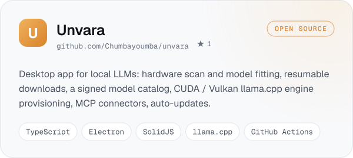
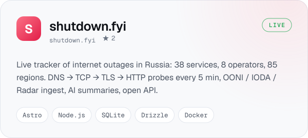
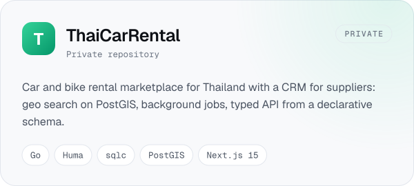
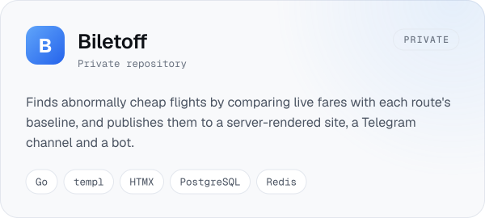
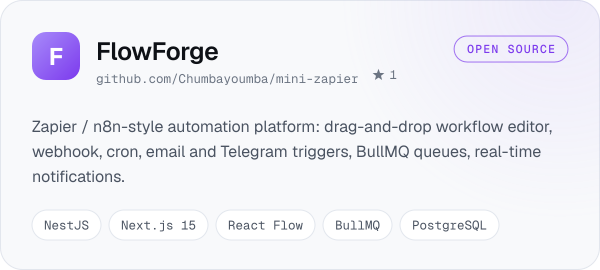
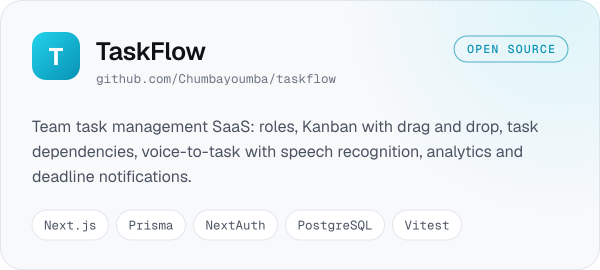
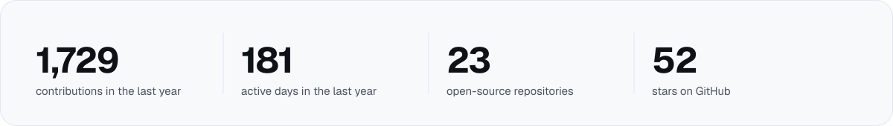

<picture>
  <source media="(prefers-color-scheme: dark)" srcset="assets/hero-dark.svg">
  
</picture>

I build products end to end — database schema, API, interface, deployment. Most of my work is Go and TypeScript:
production web services, AI tools that run on your own hardware, and Telegram bots and Mini Apps.

- 🔭 **Now:** [Unvara](https://github.com/Chumbayoumba/unvara), an open-source desktop app that runs local LLMs picked
  for your PC. [v0.1.0 is out](https://github.com/Chumbayoumba/unvara/releases/latest).
- ⚙️ **Backend:** Go (Huma, chi, Fiber, templ), Node.js (NestJS), Python (FastAPI, aiogram) · PostgreSQL, Redis,
  queues, background jobs.
- 🖥️ **Frontend & desktop:** React, Next.js 15, SolidJS, Astro, Tailwind · Electron and Tauri.
- 🚀 **Shipping:** Docker, nginx, GitHub Actions CI/CD, technical SEO.

## Featured work

<a href="https://github.com/Chumbayoumba/unvara"><picture><source media="(prefers-color-scheme: dark)" srcset="assets/card-unvara-dark.svg"></picture></a>
<a href="https://shutdown.fyi"><picture><source media="(prefers-color-scheme: dark)" srcset="assets/card-shutdown-dark.svg"></picture></a>
<picture><source media="(prefers-color-scheme: dark)" srcset="assets/card-thaicarrental-dark.svg"></picture>
<picture><source media="(prefers-color-scheme: dark)" srcset="assets/card-biletoff-dark.svg"></picture>
<a href="https://github.com/Chumbayoumba/mini-zapier"><picture><source media="(prefers-color-scheme: dark)" srcset="assets/card-flowforge-dark.svg"></picture></a>
<a href="https://github.com/Chumbayoumba/taskflow"><picture><source media="(prefers-color-scheme: dark)" srcset="assets/card-taskflow-dark.svg"></picture></a>

## Stack

<picture>
  <source media="(prefers-color-scheme: dark)" srcset="https://skillicons.dev/icons?i=go,ts,js,py,nodejs,nestjs,fastapi,bun,postgres,redis,sqlite,prisma&theme=dark&perline=12">
  
</picture>
 
<picture>
  <source media="(prefers-color-scheme: dark)" srcset="https://skillicons.dev/icons?i=react,nextjs,solidjs,astro,htmx,tailwind,vite,electron,tauri,docker,nginx,githubactions&theme=dark&perline=12">
  
</picture>

## Open source

| Project | What it is |
|---|---|
| [**unvara**](https://github.com/Chumbayoumba/unvara)  | Private AI on your own computer: local LLMs, a chat and a coding agent |
| [**shutdown-fyi-open**](https://github.com/Chumbayoumba/shutdown-fyi-open)  | Open API, widget and methodology of shutdown.fyi |
| [**free-telegram-proxy-russia-2026**](https://github.com/Chumbayoumba/free-telegram-proxy-russia-2026)  | Working MTProto proxies for Telegram with fake-TLS |
| [**simple-prompt-optimizer**](https://github.com/Chumbayoumba/simple-prompt-optimizer)  | MCP server that optimizes prompts through OpenRouter |
| [**tg-mini-app-template**](https://github.com/Chumbayoumba/tg-mini-app-template)  | Telegram Mini App template: React, TypeScript, TON Connect |
| [**aiogram-starter-kit**](https://github.com/Chumbayoumba/aiogram-starter-kit)  | Production-ready Telegram bot: aiogram 3, PostgreSQL, Docker |
| [**deepgram-push-to-talk-windows**](https://github.com/Chumbayoumba/deepgram-push-to-talk-windows)  | Push-to-talk speech-to-text for Windows |

## On GitHub

<picture>
  <source media="(prefers-color-scheme: dark)" srcset="assets/stats-dark.svg">
  
</picture>

## Contact

Open to interesting products and teams. The fastest way to reach me is Telegram:

The images on this page are drawn by <a href="tools/build.py">tools/build.py</a> and refreshed daily by GitHub Actions.
